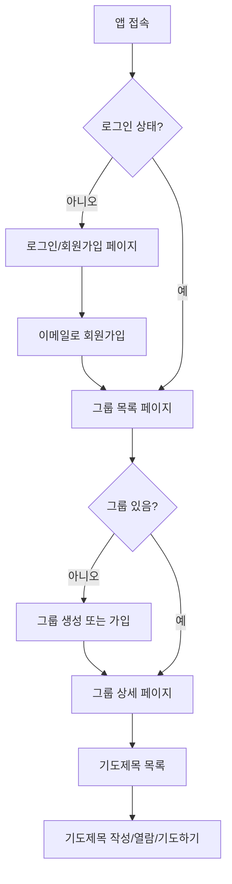

# Together Pray - 앱 문서

> 기도 공동체를 위한 웹 애플리케이션

---

## 목차

1. [앱 개요](#앱-개요)
2. [사용자 플로우](#사용자-플로우)
3. [페이지별 기능](#페이지별-기능)
4. [핵심 컴포넌트](#핵심-컴포넌트)
5. [데이터 모델](#데이터-모델)
6. [API 엔드포인트](#api-엔드포인트)
7. [비즈니스 규칙](#비즈니스-규칙)

---

## 앱 개요

**Together Pray**는 교회 소그룹이나 기도 모임을 위한 기도제목 공유 및 관리 웹 애플리케이션입니다.

### 기술 스택
- **Frontend**: Next.js 16 (App Router) + React + TypeScript
- **Styling**: TailwindCSS + Framer Motion (애니메이션)
- **Backend**: NestJS + TypeScript
- **Database**: PostgreSQL + Prisma ORM
- **인증**: JWT 기반 이메일 인증

### 주요 특징
- 모바일 우선 반응형 디자인
- 다크모드/라이트모드 지원
- 실시간 기도 상호작용
- 익명 기도제목 지원

---

## 사용자 플로우

### 1. 신규 사용자 플로우

```
[앱 접속] → [회원가입] → [그룹 생성/가입] → [기도제목 작성/열람]
```



### 2. 일반 사용자 플로우

```
[로그인] → [그룹 선택] → [기도제목 열람] → [함께 기도하기] → [업데이트 확인]
```

### 3. 기도제목 작성자 플로우

```
[기도제목 작성] → [업데이트 추가] → [상태 변경] → [응답 완료 처리]
```

---

## 페이지별 기능

### 인증 페이지 (비로그인)

| 페이지 | 경로 | 기능 |
|--------|------|------|
| **로그인** | `/login` | 이메일/비밀번호 로그인 |
| **회원가입** | `/signup` | 이름, 이메일, 비밀번호로 회원가입 |

---

### 그룹 관련 페이지

#### `/groups` - 그룹 목록
**역할**: 사용자가 속한 모든 그룹을 표시하는 메인 허브

**기능**:
- 내 그룹 목록 조회
- 그룹별 멤버 수, 기도제목 수 표시
- 그룹 생성/가입 버튼
- 그룹 선택하여 상세 페이지 이동

**UI 요소**:
- 그룹 카드 (이름, 설명, 멤버 수, 기도제목 수)
- 상단 헤더 (테마 토글, 로그아웃)
- 하단 네비게이션

---

#### `/groups/create` - 그룹 생성
**역할**: 새로운 기도 그룹 생성

**기능**:
- 그룹명 입력 (필수, 2자 이상)
- 그룹 설명 입력 (선택)
- 생성 시 자동으로 관리자 권한 부여
- 초대 코드 자동 생성

**입력 필드**:
| 필드 | 필수 | 제한 |
|------|------|------|
| 그룹명 | O | 2~50자 |
| 설명 | X | 500자 이내 |

---

#### `/groups/join` - 그룹 가입
**역할**: 초대 코드로 기존 그룹에 가입

**기능**:
- 초대 코드 입력
- 유효성 검증 후 그룹 가입
- 가입 완료 시 그룹 상세 페이지로 이동

---

#### `/groups/[id]` - 그룹 상세
**역할**: 특정 그룹의 정보와 멤버 관리

**기능**:
- 그룹 정보 표시 (이름, 설명)
- 통계 표시 (멤버 수, 기도제목 수)
- 기도제목 목록 바로가기
- 응답된 기도 목록 바로가기
- **관리자 전용**: 초대 코드 표시 및 복사
- 멤버 목록 (이름, 이메일, 역할, 가입일)

**표시 정보**:
```
┌─────────────────────────────────┐
│  그룹명                          │
│  [관리자 배지]                    │
│  설명 텍스트                      │
│                                  │
│  ┌─────────┐  ┌─────────┐       │
│  │ 👥 3    │  │ 🙏 15   │       │
│  │ 멤버    │  │ 기도제목 │       │
│  └─────────┘  └─────────┘       │
│                                  │
│  [기도제목 보기]                  │
│  [응답된 기도 보기]               │
└─────────────────────────────────┘
```

---

### 기도제목 관련 페이지

#### `/groups/[id]/prayers` - 기도제목 목록
**역할**: 그룹 내 모든 기도제목 표시 및 필터링

**기능**:
- 기도제목 목록 조회
- 상태별 필터링 (전체/기도중/부분응답/응답완료)
- 페이지네이션 (20개씩)
- 기도제목 작성 버튼
- 각 기도제목에서 바로 기도하기

**필터 옵션**:
| 필터 | 값 | 설명 |
|------|-----|------|
| 전체 | `all` | 모든 기도제목 |
| 기도중 | `praying` | 진행 중인 기도 |
| 부분 응답 | `partial_answer` | 부분적으로 응답된 기도 |
| 응답 완료 | `answered` | 완전히 응답된 기도 |

---

#### `/groups/[id]/prayers/new` - 기도제목 작성
**역할**: 새로운 기도제목 등록

**기능**:
- 제목 입력 (필수, 2자 이상)
- 내용 입력 (필수, 5자 이상)
- 카테고리 선택 (선택)
- 익명 작성 토글

**카테고리 옵션**:
- 개인, 가족, 건강, 학업/직장, 관계, 신앙, 감사, 기타

**입력 필드**:
| 필드 | 필수 | 제한 |
|------|------|------|
| 제목 | O | 2~100자 |
| 내용 | O | 5~2000자 |
| 카테고리 | X | 선택형 |
| 익명 | X | 토글 |

---

#### `/groups/[id]/answered` - 응답된 기도 목록
**역할**: 응답 완료된 기도제목만 모아보기

**기능**:
- 응답된 기도제목 목록 조회
- 페이지네이션
- 감사와 은혜의 기록 열람

---

#### `/prayers/[id]` - 기도제목 상세
**역할**: 기도제목의 전체 내용과 업데이트 타임라인 표시

**기능**:
- 기도제목 전체 내용 표시
- 작성자 정보 (익명인 경우 "익명" 표시)
- 상태 배지 표시
- 함께 기도하기 버튼
- 기도한 사람 수 표시

**작성자 전용 기능**:
- 상태 변경 (기도중 → 부분응답 → 응답완료)
- 기도제목 삭제
- 업데이트 작성
- 업데이트 삭제

**업데이트 타임라인**:
```
● 2024.01.15 - 오늘 병원에서 좋은 소식을 들었습니다
│
● 2024.01.10 - 검사 결과를 기다리고 있습니다
│
● 2024.01.05 - 기도제목 작성
```

---

### 마이페이지

#### `/mypage` - 내 정보
**역할**: 사용자 프로필 및 활동 내역 관리

**탭 구성**:

| 탭 | 기능 |
|----|------|
| **내 기도제목** | 내가 작성한 모든 기도제목 |
| **기도한 기도제목** | 내가 기도한 다른 사람의 기도제목 |
| **프로필 설정** | 이름 수정, 이메일 확인 |

**프로필 정보**:
- 이름 (수정 가능)
- 이메일 (읽기 전용)
- 프로필 아바타 (이름 첫 글자)

---

## 핵심 컴포넌트

### 네비게이션

#### Header
**위치**: 모든 페이지 상단

**구성요소**:
- 뒤로가기 버튼 (선택적)
- 페이지 제목
- 테마 토글 (라이트/다크/시스템)
- 로그아웃 버튼

#### BottomNav
**위치**: 모바일 화면 하단 (고정)

**표시 조건**: 모바일에서만 표시 (`md:hidden`)

**메뉴 항목** (그룹 내부):
| 아이콘 | 라벨 | 경로 |
|--------|------|------|
| 🏠 | 홈 | `/groups/[id]` |
| 🙏 | 기도 | `/groups/[id]/prayers` |
| ✓ | 응답 | `/groups/[id]/answered` |
| 👤 | 내정보 | `/mypage` |

---

### 기도 관련 컴포넌트

#### PrayerCard
**용도**: 기도제목 목록에서 각 항목 표시

**표시 정보**:
- 작성자 아바타 및 이름
- 작성 시간 (상대적: "5분 전", "3일 전")
- 상태 배지
- 제목
- 내용 미리보기 (3줄 제한)
- 카테고리 태그
- 기도한 사람 수
- 기도하기 버튼

#### PrayButton
**용도**: "함께 기도했어요" 상호작용

**상태**:
| 상태 | 표시 | 동작 |
|------|------|------|
| 기도 가능 | "기도하기" | 클릭 시 기도 등록 |
| 기도 완료 | "오늘 기도함 ✓" | 비활성화 |
| 로딩 중 | 스피너 | 비활성화 |

**특수 기능**:
- 기도 성공 시 축하 애니메이션 (이모지 파티클)
- 기도한 사람 목록 모달

#### EmptyState
**용도**: 데이터가 없을 때 표시

**타입**:
- `prayers`: 기도제목 없음
- `groups`: 그룹 없음
- `answered`: 응답된 기도 없음

---

### 로딩 컴포넌트

#### Skeleton
**용도**: 데이터 로딩 중 플레이스홀더

**종류**:
- `PrayerListSkeleton`: 기도제목 목록 로딩
- `GroupListSkeleton`: 그룹 목록 로딩
- `Skeleton`: 범용 스켈레톤

---

## 데이터 모델

### User (사용자)
```typescript
interface User {
  id: string;
  email: string;
  name: string;
  createdAt: string;
}
```

### Group (그룹)
```typescript
interface Group {
  id: string;
  name: string;
  description?: string;
  inviteCode: string;
  createdAt: string;
  members: GroupMember[];
  _count: {
    prayerItems: number;
  };
}
```

### GroupMember (그룹 멤버)
```typescript
interface GroupMember {
  id: string;
  userId: string;
  groupId: string;
  role: 'admin' | 'member';
  joinedAt: string;
  user: {
    id: string;
    name: string;
    email: string;
  };
}
```

### PrayerItem (기도제목)
```typescript
interface PrayerItem {
  id: string;
  title: string;
  content: string;
  category?: string;
  status: 'praying' | 'partial_answer' | 'answered';
  isAnonymous: boolean;
  createdAt: string;
  updatedAt: string;
  groupId: string;
  authorId: string;
  author: {
    id: string;
    name: string;
  };
  group?: {
    id: string;
    name: string;
  };
  _count: {
    reactions: number;
  };
  hasPrayedToday: boolean;
  isAuthor: boolean;
}
```

### PrayerUpdate (기도 업데이트)
```typescript
interface PrayerUpdate {
  id: string;
  content: string;
  createdAt: string;
  author?: {
    id: string;
    name: string;
  };
  isAuthor: boolean;
}
```

### PrayerStatus (기도 상태)
```typescript
type PrayerStatus = 'praying' | 'partial_answer' | 'answered';
```

| 상태 | 한글 | 배지 색상 |
|------|------|----------|
| `praying` | 기도중 | 파란색 |
| `partial_answer` | 부분 응답 | 노란색 |
| `answered` | 응답 완료 | 초록색 |

---

## API 엔드포인트

### 인증 API

| 메서드 | 엔드포인트 | 설명 |
|--------|-----------|------|
| POST | `/auth/signup` | 회원가입 |
| POST | `/auth/login` | 로그인 |
| GET | `/auth/me` | 현재 사용자 정보 |

### 그룹 API

| 메서드 | 엔드포인트 | 설명 |
|--------|-----------|------|
| POST | `/groups` | 그룹 생성 |
| GET | `/groups` | 내 그룹 목록 |
| GET | `/groups/:id` | 그룹 상세 |
| POST | `/groups/join` | 그룹 가입 |

### 기도제목 API

| 메서드 | 엔드포인트 | 설명 |
|--------|-----------|------|
| POST | `/prayer-items` | 기도제목 생성 |
| GET | `/prayer-items?groupId=&status=&page=&limit=` | 기도제목 목록 |
| GET | `/prayer-items/:id` | 기도제목 상세 |
| PATCH | `/prayer-items/:id/status` | 상태 변경 |
| DELETE | `/prayer-items/:id` | 기도제목 삭제 |

### 기도 업데이트 API

| 메서드 | 엔드포인트 | 설명 |
|--------|-----------|------|
| POST | `/prayer-updates` | 업데이트 작성 |
| GET | `/prayer-updates?prayerItemId=` | 업데이트 목록 |
| DELETE | `/prayer-updates/:id` | 업데이트 삭제 |

### 기도 반응 API

| 메서드 | 엔드포인트 | 설명 |
|--------|-----------|------|
| POST | `/prayer-reactions/:prayerItemId` | 기도하기 |
| GET | `/prayer-reactions/:prayerItemId/list` | 기도한 사람 목록 |

### 사용자 API

| 메서드 | 엔드포인트 | 설명 |
|--------|-----------|------|
| GET | `/users/me/prayer-items` | 내 기도제목 |
| GET | `/users/me/prayed-items` | 기도한 기도제목 |
| PATCH | `/users/me` | 프로필 수정 |

---

## 비즈니스 규칙

### 기도 반응 규칙
- **1일 1회 제한**: 같은 기도제목에 하루에 한 번만 기도 가능
- 자정(00:00) 기준으로 초기화
- 기도 횟수는 누적 표시

### 익명 기도제목 규칙
- 작성자 본인과 서버만 실제 작성자 확인 가능
- 다른 그룹원에게는 "익명"으로 표시
- 업데이트도 익명으로 표시

### 권한 규칙

| 기능 | 작성자 | 관리자 | 일반 멤버 |
|------|--------|--------|----------|
| 기도제목 작성 | - | O | O |
| 기도제목 수정 | O | X | X |
| 기도제목 삭제 | O | X | X |
| 상태 변경 | O | X | X |
| 업데이트 작성 | O | X | X |
| 업데이트 삭제 | O | X | X |
| 초대 코드 확인 | - | O | X |
| 기도하기 | O | O | O |

### 그룹 규칙
- 그룹 생성자는 자동으로 관리자
- 초대 코드는 그룹당 고유
- 모든 기도제목은 그룹에 귀속

---

## 테마 시스템

### 지원 테마
| 테마 | 설명 |
|------|------|
| `light` | 밝은 테마 |
| `dark` | 어두운 테마 |
| `system` | 시스템 설정 따름 |

### CSS 변수
```css
--color-bg-primary      /* 메인 배경 */
--color-bg-secondary    /* 보조 배경 */
--color-bg-tertiary     /* 3차 배경 */
--color-text-primary    /* 메인 텍스트 */
--color-text-secondary  /* 보조 텍스트 */
--color-text-tertiary   /* 3차 텍스트 */
--color-border          /* 테두리 */
--color-accent-blue     /* 강조 파란색 */
--color-accent-green    /* 강조 초록색 */
--color-accent-red      /* 강조 빨간색 */
```

---

## 화면 구성도

### 전체 앱 구조
```
┌─────────────────────────────────────────┐
│              Together Pray               │
├─────────────────────────────────────────┤
│                                         │
│  ┌─────────┐     ┌─────────────────┐   │
│  │ 로그인   │────→│    그룹 목록     │   │
│  │ 회원가입 │     │                 │   │
│  └─────────┘     └────────┬────────┘   │
│                           │             │
│         ┌─────────────────┼─────────────┤
│         │                 │             │
│         ▼                 ▼             │
│  ┌─────────────┐   ┌─────────────┐     │
│  │ 그룹 생성   │   │  그룹 상세   │     │
│  │ 그룹 가입   │   │             │     │
│  └─────────────┘   └──────┬──────┘     │
│                           │             │
│         ┌─────────────────┼─────────────┤
│         │                 │             │
│         ▼                 ▼             │
│  ┌─────────────┐   ┌─────────────┐     │
│  │ 기도제목    │   │ 응답된 기도  │     │
│  │ 목록        │   │ 목록        │     │
│  └──────┬──────┘   └─────────────┘     │
│         │                               │
│         ▼                               │
│  ┌─────────────┐   ┌─────────────┐     │
│  │ 기도제목    │   │ 기도제목    │     │
│  │ 작성        │   │ 상세        │     │
│  └─────────────┘   └─────────────┘     │
│                                         │
│  ┌─────────────────────────────────┐   │
│  │           마이페이지             │   │
│  │  (내 기도제목 / 기도한 목록 / 설정) │   │
│  └─────────────────────────────────┘   │
│                                         │
└─────────────────────────────────────────┘
```

---

*최종 업데이트: 2026년 1월 29일*
